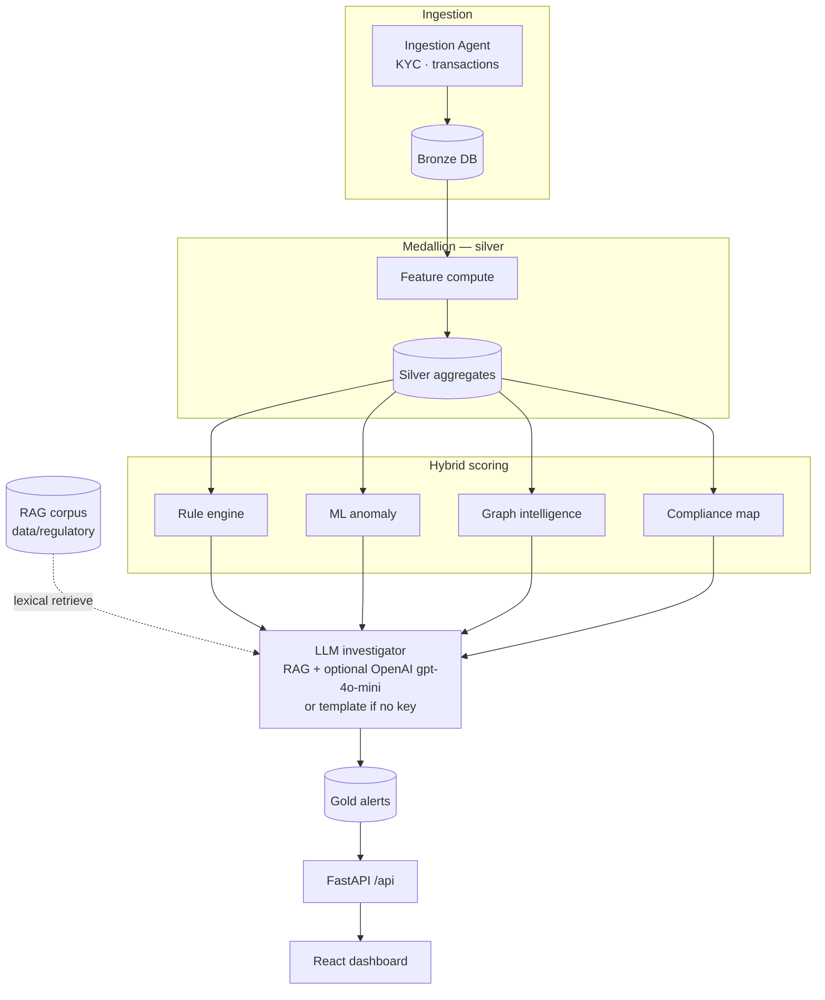

# AML AI System — architecture

Flow image and editable Mermaid: [`PIPELINE_FLOW.md`](./PIPELINE_FLOW.md).

## Repository layout

```
aml-ai-system/
├── frontend/           # React dashboard (case queue + investigator workspace)
├── backend/            # FastAPI service, SQLAlchemy models, API routes
├── agents/             # Ingestion, graph intelligence, compliance mapping, RAG, LLM investigator
├── models/             # ML (isolation forest features) + deterministic rule engine
├── data/               # Regulatory snippets + synthetic data notes
├── notebooks/          # Experiments (offline)
├── docs/               # This folder
└── docker/             # Postgres, Neo4j, Kafka stack
```

## Runtime imports

The API process needs **both** packages on `PYTHONPATH`:

- `backend/` — exposes the `app` package (`app.main:app`).
- Repository root — exposes `agents` and `models`.

`backend/run_dev.sh` sets `PYTHONPATH` accordingly.

## Detection pipeline (hybrid)

1. **Bronze** transactions + KYC land in PostgreSQL (`agents.ingestion`).
2. **Silver** aggregates recomputed (`backend/app/services/feature_compute.py`).
3. **Gold** alerts produced by `backend/app/services/scoring_pipeline.py`:
   - `models.rule_engine` — auditable rule IDs.
   - `models.anomaly` — behavioural scoring with interpretable feature vector.
   - `agents.graph_intelligence` — NetworkX cluster / edge metrics (Neo4j-ready).
   - `agents.compliance` — maps rules to AUSTRAC-oriented obligation hints (non-legal).
   - `agents.llm_investigator` — RAG over `data/regulatory/` (+ optional OpenAI).

## Pipeline flow (Mermaid)

Rendered on GitHub / in Mermaid-compatible viewers. Same diagram with image: [`PIPELINE_FLOW.md`](./PIPELINE_FLOW.md).



## Deployment notes

- Swap lexical RAG for embeddings + vector DB when moving beyond demos.
- Wire `agents/graph_intelligence.py` to Neo4j via MCP or internal client for production graph projections.
- Replace demo SMR language with institution-specific policies approved by legal/compliance.
