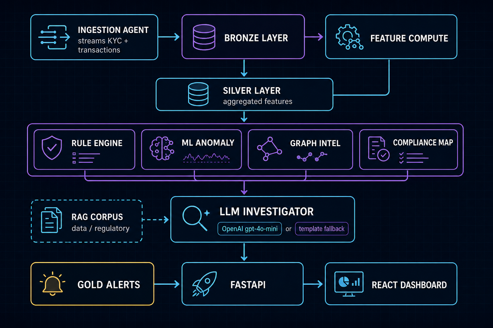
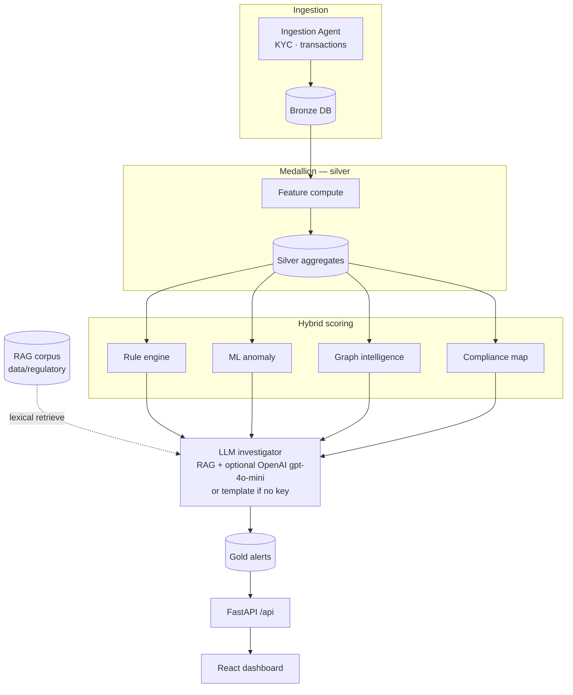

# AML-AI-SYSTEM — pipeline flow

Visual and diagrammatic view of the hybrid detection stack (see [`ARCHITECTURE.md`](./ARCHITECTURE.md) for file-level detail).

## Flow image

## Mermaid

Renders on GitHub and in Mermaid Live / compatible tools. Copy the fenced block below if you need it elsewhere.

